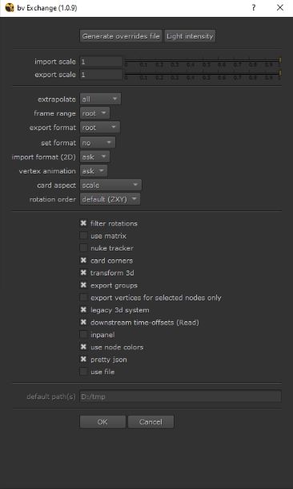

# Settings and Tooltips

## Export scale
Export scale for 3D objects.

It's recommended to keep this value at 1 and assume 1 Nuke unit = 1 meter.

Note that ReadGeo/GeoImport nodes are not scaled.

---

## Import scale
Import scale for 3D objects.

It's recommended to keep this value at 1 and assume 1 Nuke unit = 1 meter.

Note that ReadGeo/GeoImport nodes are not scaled.

---

## Extrapolate
Use linear extrapolation when importing animated objects.

Use this option to get correct motion blur on first/last frame.

---

## Frame range method
Export frame range

root: Use the Root frame range.

ask: Prompt user for frame range.

Temporarily set this to "ask" by holding down the "Ctrl+Shift" keys.

---

## Export format
Export format (width/height/pixel aspect).

root: Use the Root format.

ask: Open a dialog box with all available formats.

custom: Specify the format by name. Can be multiple values separated by comma/semi-colon. First match will be used. If no match is found the Root format is used.

Temporarily set this to "ask" by holding down the "Ctrl" key.

---

## Set format
The "Setup" command sets frame-range and fps by default, but it can also set the Root format.

no: Do not change the Root format.

scene: Set the Root format to the same value as the exported scene.

ask: Show a dialog box with all available formats (scene/images).

The name of a new format will be i.e 1980x1080. Override this name by setting the EX_NUKE_FORMAT_NAME environment variable.

Temporarily set this to "ask" by holding down the "Ctrl" key.

---

## Import format
Import format when importing 2D data from 3D objects (Reconcile3D).

root: Use the Root format.

ask: Open a dialog box with all available formats.

Temporarily set this to "ask" by holding down the "Ctrl" key.

---

## Vertex anim
Vertices can be exported as animated or static.

ask: Ask the user if the vertices (or objects) are animated.

yes: Export animation. Note that this option can use a lot of RAM/CPU for heavy scripts.

no: Export static vertices.

Temporarily set this to "yes" by holding down the "Shift" key.

---

## Rotation order
The rotation order of the imported 3D objects.

default (ZXY): Imports the data using ZXY rotation order.

keep: Use the same rotation order as the export.

---

## Filter rotations
Apply a Euler filter to the rotation curves to avoid flipping.

---

## Use matrix
Sometimes the matrix of a 3D object can't be decomposed as translate/rotate/scale values.

For example this could happen when using a parenting chain with rotation and non uniform scale (as that will introduce a skew)

This checkbox will import the data into the matrix knob which will give the correct transform.

---

## Nuke tracker
Import 2D data to a Tracker4 node instead of a custom node.

---

## Card corners
Export each corner of a card when doing a 3D to 2D export.

This will essentially export the Card as a CornerPin.

---

## Use transform3d
Some node-based applications (i.e Nuke, Houdini) can export "transform 3d" nodes.

Checked: Import as TransformGeo.

Unchecked: Import as Axis.

---

## Export groups
Export all supported nodes inside selected groups.

---

## Vertex node selection
Only export vertices for nodes selected in the DAG.

If not checked all selected vertices will be exported.

---

## Card aspect
Cards are imported with the "use aspect" knob checked. This may result in a card with incorrect aspect ratio.

checkerboard: Add a checkerboard texture to the card with correct aspect ratio.

scale: Scale the Y-axis based on the aspect ratio.

none: Do nothing.

---

## Legacy 3D
Import as nodes supported by the legacy 3D system (pre Nuke 14).

---

## Inpanel
Open created nodes in the properties bin.

---

## Downstream time offsets
Include downstream time-offsets for Read nodes. Check max 5 nodes downstream.

---

## Use node colors
Set tile-color for Transform/CornerPin nodes and gl-color for Axis nodes.

Override color values in exchange_nuke/colors.py

---

## Pretty json
Use "readable" formatting for json files.

Note that this option will make the json file larger and therefore it might be slower to import in applications that aren't using Python (such as After Effects).

---

## Use file
Open a file-browser when saving/loading exchange data.

Use this option to share data with other users.

---

## Default path
Default path to save the json file if "use file" is checked.

If multiple paths are set (separated by semi-colon), the first existing path will be used.

Support for environment variables using $<name> syntax (i.e path/to/$PROJ/$SHOT).

Note that you can override the regular export with the EXCHANGE_JSON_PATH environment variable as well.

## Generate class overrides file
It's possible to override the node classes for created nodes.

For example a Camera node is by default created (imported) as a "Camera2" (to keep backwards compatibility), but by exporting an overrides file a different class can be used instead (i.e Camera3).

Overrides are available for all supported 3D nodes and it's possible to have different defaults for the legacy and the new 3D system.

The file is called "_bv_exchange_class_overrides.json" and is saved in the users ".nuke" directory. The path can be overriden with EX_NUKE_OVERRIDES_PATH environment variable.

*Make sure to keep the formatting of the json file intact (keeping quotes/commas).

---

## Light Intensity
Specify values to multiply light intensity for export/import. Default at 1.

---