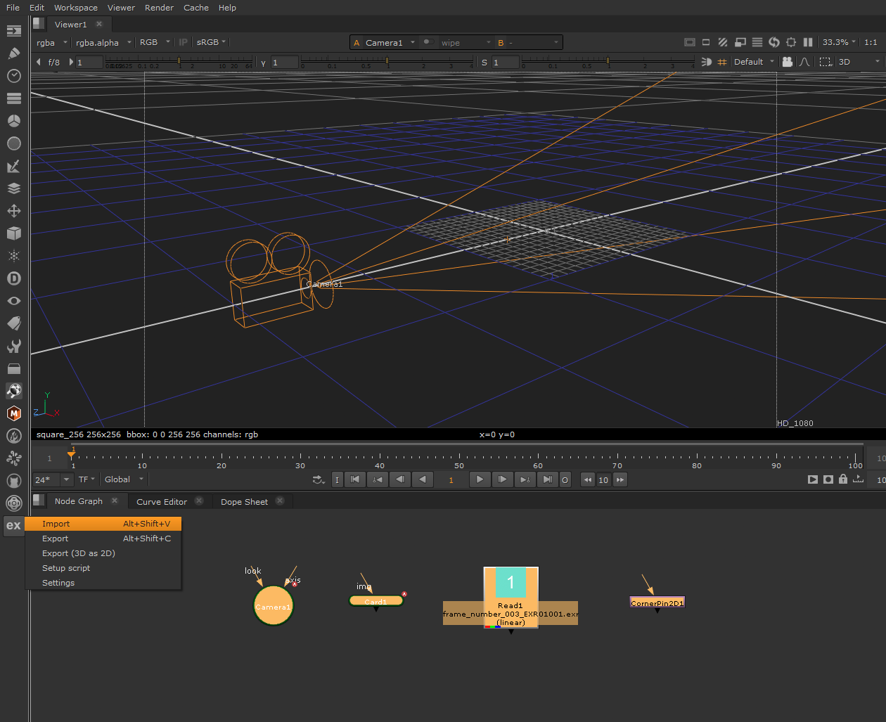
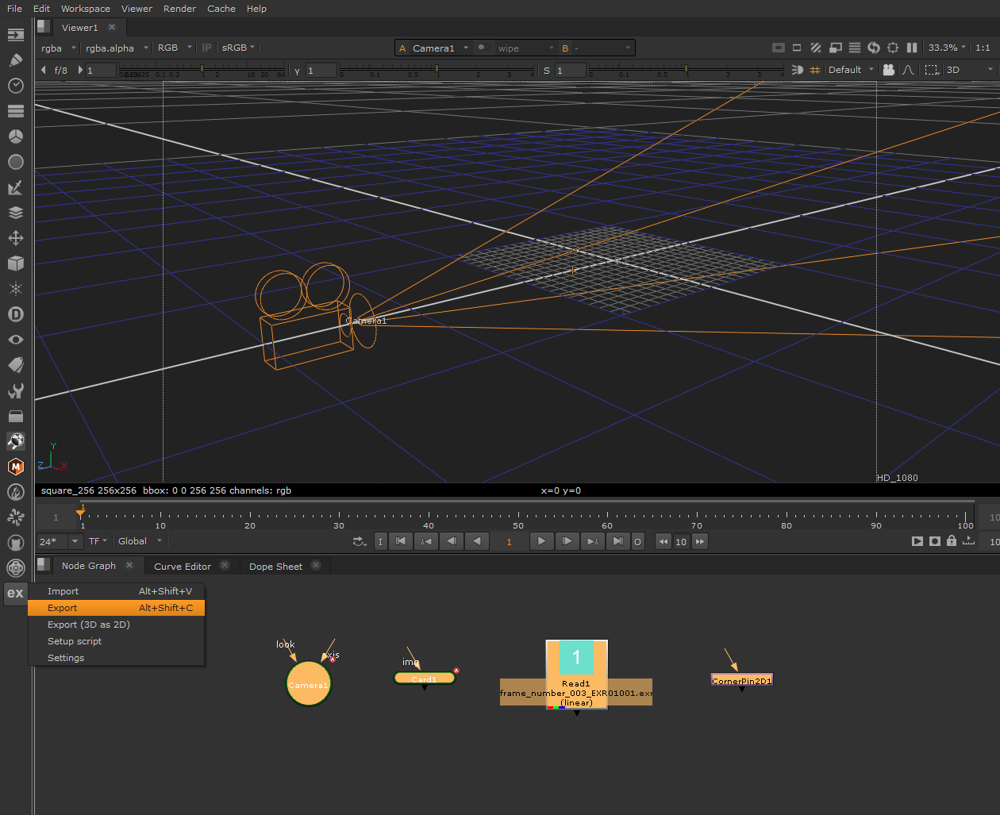
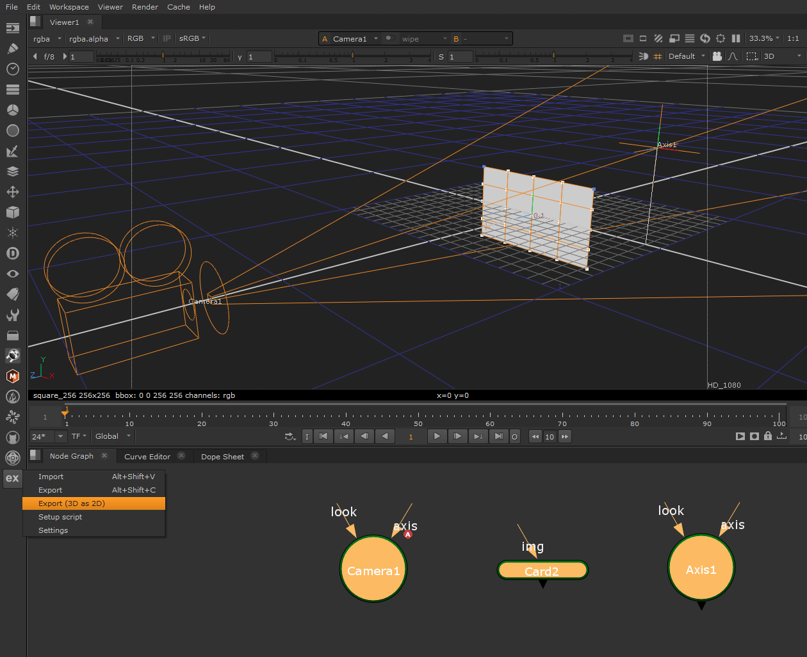
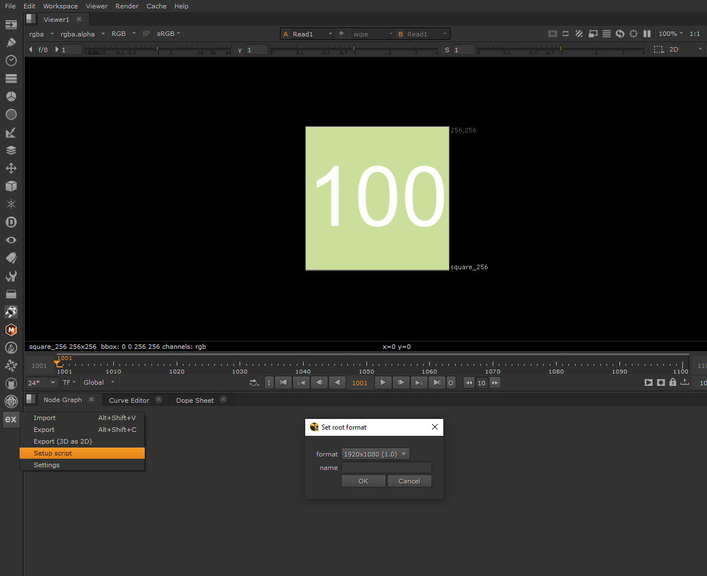

## Import

- Go to the ex toolbar and press `Import` (shortcut ctrl+alt+v).

## Export

- Select the nodes you want to export (check supported nodes section). Can be both 3D and 2D.
- Go to the ex toolbar and press `Export` (shortcut ctrl+alt+c).

## Export 3D as 2D

- Select the 3D nodes and/or mesh vertices. Also select a Camera node (needed for 3D to 2D conversion).
- Go to the ex toolbar and press `Export 3D as 2D`.

## Setup script

- Go to the ex toolbar and press `Setup script`.

