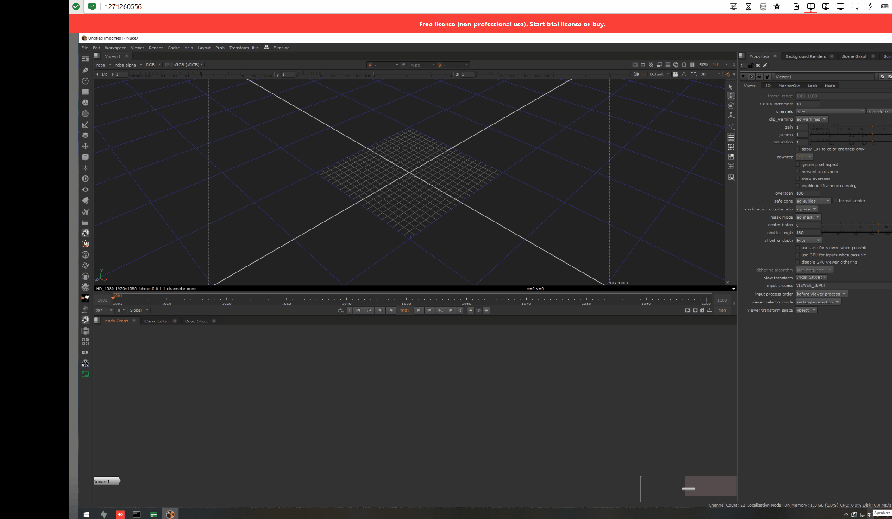
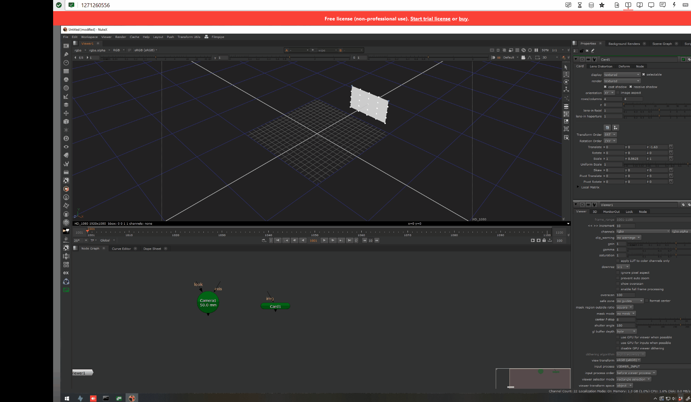

## Export

USE STILL IMAGES FOR EXMAPLE?

- Select the nodes you want to export (check supported nodes section)
- Go to the ex toolbar and press "Export" (shortcut ctrl+alt+c)

## Import

- Go to the ex toolbar and press "Import" (shortcut ctrl+alt+v)

## Export 3D as 2D

- Select the 3D nodes/vertices and a Camera node.
- Go to the ex toolbar and press "Export 3D as 2D".

## Setup script

- Go to the ex toolbar and press "Setup scene

